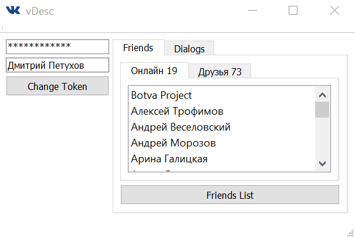
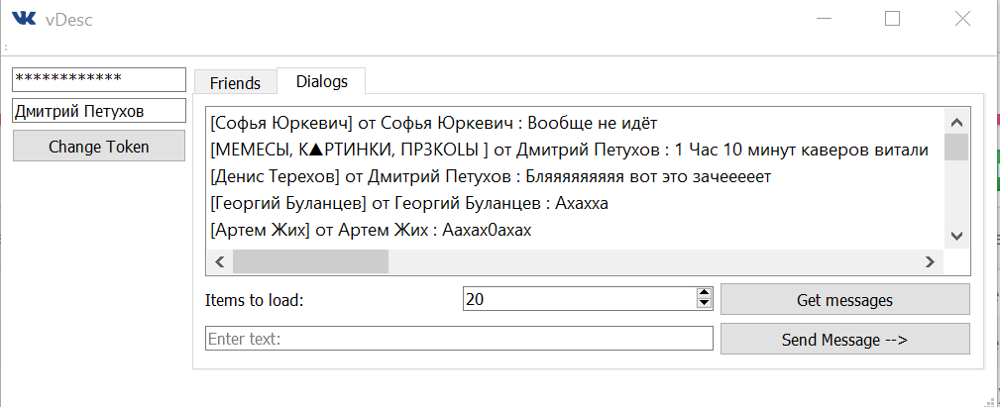

# vDesc 

Cute vk desktop client written in pure C++/Qt

***At this stage vDesc is able to show your vk friends/friends online, display your dialogs/chats, display history on particular dialog/chat, send and receive messages, including emoji(if message contains attachment vDesc will display its type if [it's not text])***

Now you can easily browse [vk.com](https://vk.com/) from your desktop c:

## How do i do this?
1) Use this [link](https://oauth.vk.com/authorize?client_id=5580473&display=page&redirect_uri=https://oauth.vk.com/blank.html&scope=friends,wall,messages,offline&response_type=token&v=5.85)
2) Press “Allow”. You will be redirected to a new page with a warning that the token must not be copied or given to a third party. In the address bar, there will be the URL https://oauth.vk.com/blank.html, and after it a #. You will see the additional parameters – access_token, expires_in and user_id. The token may look like this: 

        51eff86578a3bbbcb5c7043a122a69fd04dca057ac821dd7afd7c2d8e35b60172d45a26599c08034cc40a

The token is your access key. While completing certain conditions, a person who received your token may cause significant damage to other people’s data, including yours. That’s why it is very important to not give the token to a third party. 

Use this token to login by pasting it into this application (first QLineEdit at the left top corner of the window)

Screenshots provide will provide you with the general look of this application

# Please notice
This app is still in development. Some features may be unavailiable

# Built With
- [Qt](http://www.qt.io/) - user interface and internal logic
- [vk API](https://vk.com/dev) - vk api queries

- [Qt documentation](http://doc.qt.io/)
- [VK documentation](https://vk.com/dev/first_guide)

These instructions will get you a copy of the project up and running on your local machine for development and testing purposes.

## Installing
- Download and run Qt Creator, download this project, then open '.pro' file, setup your project. 
- Or just download project, go to release directory and run vDesc.exe

# Authors
- Dmitry Petukhov - Initial work/founder

# Acknowledgments
  - You can help me to develop this program or to make it better for your puproses 
  - Feel free to make it look the way you like
 
